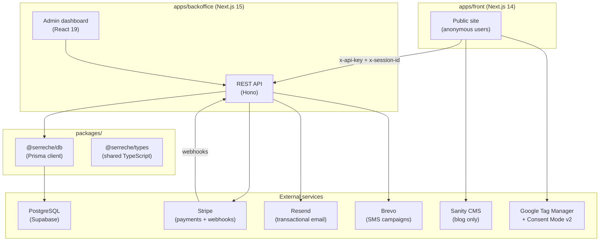

# Paragliding School — Full-Stack SaaS

> Booking and business management platform for a seasonal outdoor activity school. Full-stack monorepo built as a portfolio project, based on a real production application.

[](https://github.com/fredf/serre-chevalier-parapente/actions/workflows/ci.yml)
[](https://www.typescriptlang.org/)
[](./LICENSE)

---

## Screenshots


---

## Context

This project models the full operational stack of a seasonal paragliding school: a public-facing booking site where customers purchase training stages and one-off baptism flights, and an admin backoffice for managing schedules, clients, payments, and SMS campaigns.

The interesting engineering is in the details. Booking a stage means holding a seat for up to an hour while the customer completes checkout — without locking database rows. Stripe webhooks must finalize orders exactly once even when delivered multiple times. A single payment can cover multiple participants with a deposit/balance split, optionally discounted by a promo code, and the allocation must remain auditable after the fact. These are the kinds of problems that only surface when you take a CRUD app seriously enough to think through the edge cases.

The project is structured as a Turborepo monorepo with two Next.js applications sharing a Prisma schema. The backoffice runs on Next.js 15 + React 19; the front stays on Next.js 14 + React 18. That mismatch is intentional — the front is a stable, customer-facing surface, and upgrading React without thorough testing would be irresponsible. The split documents a pragmatic approach to dependency management in a real-world monorepo.

---

## Stack

| Layer | Technology | Version |
|---|---|---|
| **Frontend framework** | Next.js (front) | 14.2.3 |
| **Backoffice framework** | Next.js (backoffice) | 15.1.9 |
| **UI runtime** | React (front / backoffice) | 18.3 / 19.0 |
| **Language** | TypeScript | 5.x |
| **API layer** | Hono (mounted in Next.js) | 4.6.16 |
| **ORM** | Prisma | 6.16.2 |
| **Database** | PostgreSQL via Supabase | — |
| **Auth** | better-auth | 1.5.5 |
| **Payments** | Stripe | 18.5.0 |
| **Server state** | TanStack Query | 5.59.0 |
| **Client state** | Jotai | 2.12.2 |
| **Forms** | React Hook Form + Zod | 7.54 / 3.24 |
| **Email** | Resend + React Email | 6.5 / 5.0 |
| **UI components** | shadcn/ui + Radix UI | — |
| **Styling** | Tailwind CSS | 3.4.x |
| **Tests** | Vitest | 4.1.0 |
| **CI** | GitHub Actions | — |
| **Monorepo** | Turborepo + pnpm workspaces | — |
| **Deployment** | Vercel | — |

---

## Architecture



The backoffice serves two audiences from one deployment: admin users via the dashboard, and the public frontend via a REST API protected by an API key. Cart state lives entirely in the backoffice database — the frontend only stores an anonymous session UUID in localStorage.

---

## Technical Challenges

Three non-trivial problems solved in this codebase. Each is documented in detail in [`docs/CHALLENGES.md`](docs/CHALLENGES.md).

**Slot concurrency** — Booking a stage seat without locking rows. Cart items act as temporary reservations with a 1-hour TTL. Availability is calculated dynamically from confirmed bookings plus active cart items, with expired items purged before each check. [`apps/backoffice/src/lib/availability.ts`](apps/backoffice/src/lib/availability.ts)

**Stripe webhook idempotency** — `payment_intent.succeeded` can be delivered multiple times, including concurrently. A `ProcessedWebhookEvent` table with a unique constraint on the Stripe event ID acts as an atomic mutex: the first writer wins, subsequent deliveries catch the `P2002` constraint violation and return 200 immediately. [`apps/backoffice/src/app/api/webhooks/stripe/route.ts`](apps/backoffice/src/app/api/webhooks/stripe/route.ts)

**Payment allocation** — One payment split across multiple order items with a deposit/balance structure and optional promo code discount. A `PaymentAllocation` join table records exactly how much of each payment covers each line item, proportionally. Allocations are immutable once written. [`apps/backoffice/src/lib/order-processing.ts`](apps/backoffice/src/lib/order-processing.ts)

---

## Quick Start

**Prerequisites:** Node.js 20+, pnpm 9+, a PostgreSQL database (Supabase free tier works).

```bash
# Install dependencies
pnpm install

# Set up environment variables
cp apps/backoffice/.env.example apps/backoffice/.env.local
cp apps/front/.env.example apps/front/.env.local
# Edit both files — see docs/environment.md for all variables

# Run migrations
cd apps/backoffice && pnpm db:migrate

# Create first admin account
pnpm seed:admin

# Start both apps (ports 3000 + 3001)
cd ../.. && pnpm dev
```

```bash
# Run all tests
pnpm test

# Type-check all packages
pnpm typecheck

# Lint all packages
pnpm lint

# Build all packages
pnpm build
```

---

## Repository Structure

```
.
├── apps/
│   ├── backoffice/         Admin dashboard + public REST API (Next.js 15, React 19)
│   │   ├── prisma/         Schema, migrations, seed scripts
│   │   └── src/
│   │       ├── app/        Next.js App Router pages and API routes
│   │       ├── features/   Feature-based modules (stages, orders, clients…)
│   │       ├── lib/        Shared utilities (auth, availability, order processing)
│   │       └── __tests__/  Vitest unit tests
│   └── front/              Public website + e-commerce (Next.js 14, React 18)
│       └── src/
│           ├── app/        Pages (home, stages, checkout, blog…)
│           └── components/ Shared UI components
├── packages/
│   ├── db/                 Shared Prisma client (@serreche/db)
│   └── types/              Shared TypeScript types (@serreche/types)
├── docs/
│   ├── CHALLENGES.md       Technical deep-dives on the three hard problems
│   ├── DECISIONS.md        Architecture decision records (ADRs)
│   ├── architecture.md     Full architecture overview
│   ├── shop.md             Business logic reference
│   ├── api.md              API endpoint reference
│   └── environment.md      Environment variable reference
├── turbo.json              Turborepo pipeline configuration
└── pnpm-workspace.yaml     pnpm workspace definition
```

---

## License

MIT
