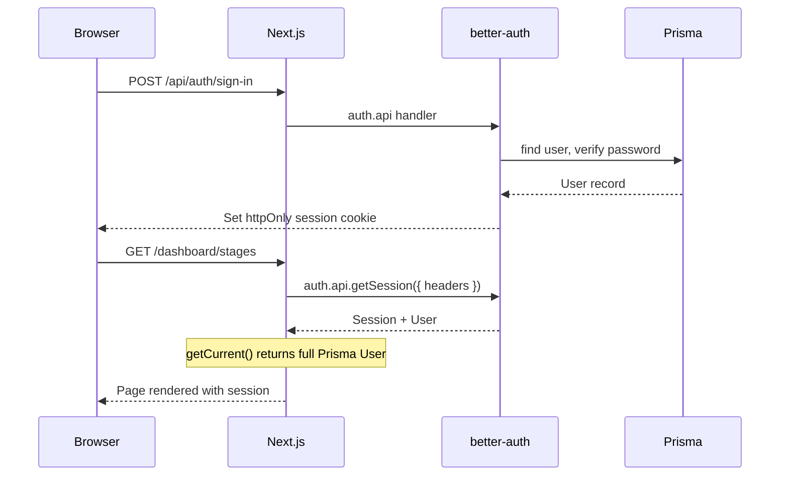
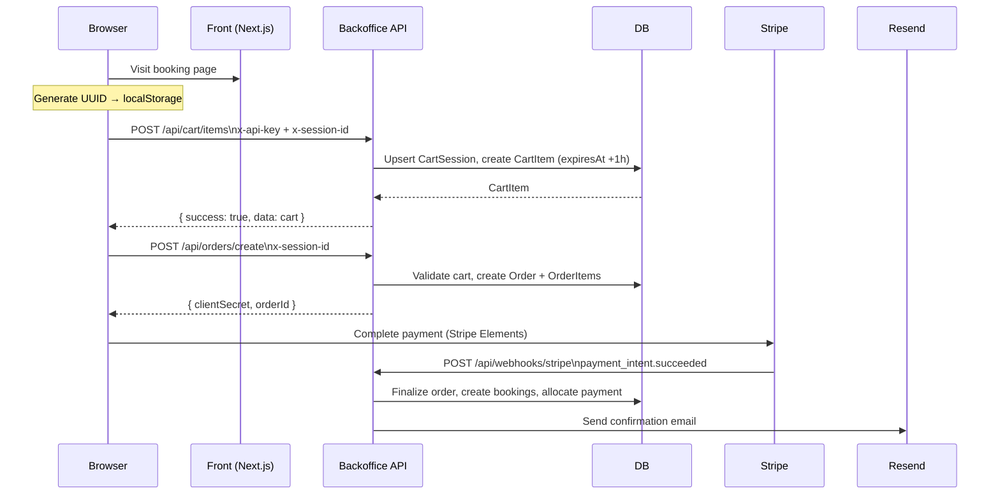
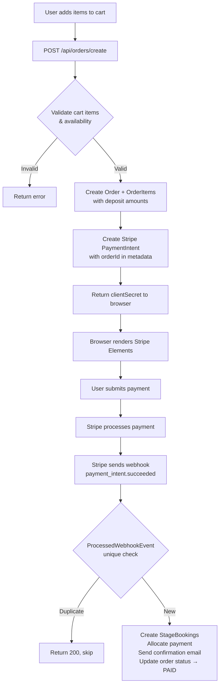

# Architecture

A systems-level description of how this monorepo is structured, why specific choices were made, and how the main flows work. For the reasoning behind individual decisions, see [DECISIONS.md](DECISIONS.md). For the three hard engineering problems, see [CHALLENGES.md](CHALLENGES.md).

---

## Why Turborepo

The frontend and backoffice share a Prisma schema and TypeScript types. Without a monorepo, keeping them in sync means duplicating type definitions or publishing packages — both options add friction to every schema change. Turborepo's task graph (`turbo.json`) ensures `packages/db` is built before either app consumes it, and its dependency-aware caching means unchanged packages don't get rebuilt in CI.

The workspace structure is:

```
packages/db      → @serreche/db     (Prisma client, generated types)
packages/types   → @serreche/types  (shared TypeScript interfaces)
apps/backoffice  → consumes both packages
apps/front       → consumes both packages
```

---

## Why App Router

Both apps use Next.js App Router (not Pages Router). The backoffice in particular benefits from React Server Components for the dashboard — data fetching happens on the server with direct Prisma calls, avoiding a round-trip through the API for admin-only pages. The frontend uses the same model for SEO-critical pages (stage listings, blog).

Route groups separate concerns:
- `(auth)/` — login, password reset (no session required)
- `(post-auth)/dashboard/` — all protected admin pages
- `api/[[...route]]` — the Hono catch-all

---

## Why Hono Inside Next.js

Native Next.js route handlers (`route.ts`) offer no middleware composition and no typed request validation. Adding auth, API key checks, and session resolution to every handler means duplicating logic or wrapping everything in ad-hoc HOFs.

Hono's middleware model (`app.use()`, chained handlers) solves this cleanly. Authentication middleware is composed per route:

```
publicAPIMiddleware      → validates x-api-key (for frontend calls)
sessionMiddleware        → validates better-auth session (for admin calls)
adminSessionMiddleware   → extends session check with ADMIN role requirement
monitorSessionMiddleware → extends session check with MONITEUR role requirement
sessionOrAPIMiddleware   → accepts either (for mixed endpoints)
```

Hono is mounted at `src/app/api/[[...route]]/route.ts`. better-auth's handler at `/api/auth/[...all]` takes priority in Next.js routing, so the two handlers never conflict.

All public API responses use a consistent envelope:

```typescript
{ success: true, data: T }
{ success: false, error: string }
```

---

## Why React 18 on the Front, React 19 on the Backoffice

See [ADR-04](DECISIONS.md#adr-04). Short version: the backoffice was greenfield when React 19 reached stable. The frontend checkout flow is revenue-critical and was not upgraded without a dedicated test pass. The two apps are separate Next.js deployments — they never share a runtime, so the version mismatch is safe.

---

## Feature-Based Layout

The backoffice follows a feature-based layout. Each domain owns its directory under `src/features/<domain>/`:

```
src/features/
├── stages/
│   ├── server/        Hono route handlers
│   ├── api/           TanStack Query hooks (useStages, useCreateStage…)
│   ├── components/    UI components (StageCalendar, StageCard…)
│   ├── forms/         React Hook Form components
│   ├── schemas.ts     Zod validation schemas
│   └── keys.ts        React Query key factories
├── orders/
├── payments/
├── clients/
└── …
```

Pages in `src/app/(post-auth)/dashboard/<domain>/` are thin shells:

```tsx
// app/(post-auth)/dashboard/stages/page.tsx
import { StagesList } from "@/features/stages/components/StagesList";

export default function StagesPage() {
  return <StagesList />;
}
```

All logic lives in the feature. The page only wires up layout and metadata.

---

## Auth Flow



`getCurrent()` is a server action that returns the full Prisma `User` record (including `role: Role` enum), not the better-auth session user. This ensures all downstream server components and actions get correctly typed Prisma objects.

`useCurrent()` is the client-side equivalent, using `authClient.getSession()` with `inferAdditionalFields<typeof auth>()` to get typed `role` and `avatarUrl` fields on the client.

---

## Anonymous Cart (Frontend ↔ Backoffice)

The public frontend has no user accounts. Cart state lives entirely in the backoffice database. The frontend generates a UUID on first visit, stores it in localStorage with a 24h TTL, and sends it as `x-session-id` on every API call.



The session UUID is the only state the frontend holds. If the user clears localStorage, their cart is lost — this is by design, since the cart items expire anyway.

---

## Checkout and Payment Flow



The `orderId` is embedded in the Stripe PaymentIntent metadata at creation time. This is how the webhook handler knows which order to finalize — it never trusts the amount from Stripe, only the `orderId` reference.

---

## Data Model (Simplified)

```
User
├── Session (better-auth)
├── Account (better-auth OAuth — not used)
└── StageMoniteur → Stage

Stage
├── StageMoniteur
├── StageBooking → Stagiaire
├── StagePromotionHistory
└── CartItem ← CartSession

Order
├── OrderItem
│   ├── stage reference
│   ├── StageBooking (1:1, created at finalization)
│   └── PaymentAllocation
├── Payment
│   ├── PaymentAllocation → OrderItem
│   └── ProcessedWebhookEvent (idempotency)
├── PromoCode → PromoCodeUsage
└── Client

SmsCampaign
├── Audience → AudienceRule
├── AudienceContact
├── SmsCampaignLog
└── PromoCode (generated per recipient)
```

---

## Deployment

Both apps deploy to Vercel as separate projects. They share the same Supabase PostgreSQL database (separate schemas are not used — all tables in `public`). Environment variables are managed per-project in Vercel.

The `DATABASE_URL` uses pgbouncer connection pooling (port 6543) for query execution. `DIRECT_URL` bypasses pgbouncer (port 5432) and is used only by Prisma Migrate, which requires a direct connection for DDL statements.
